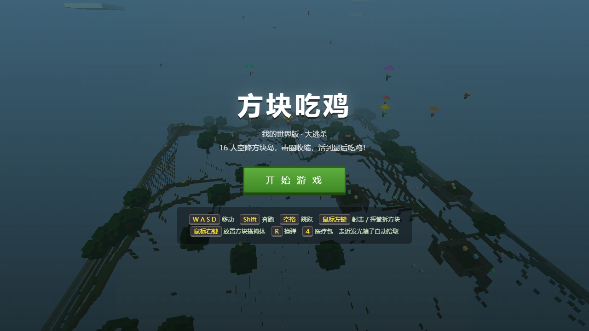
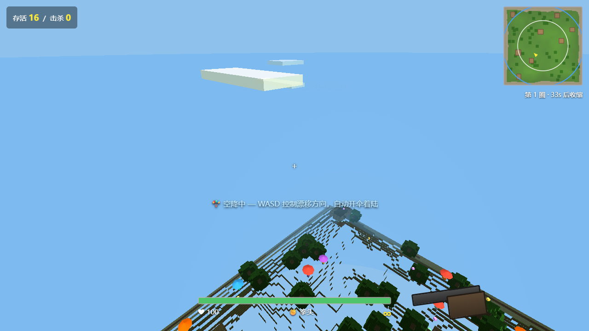
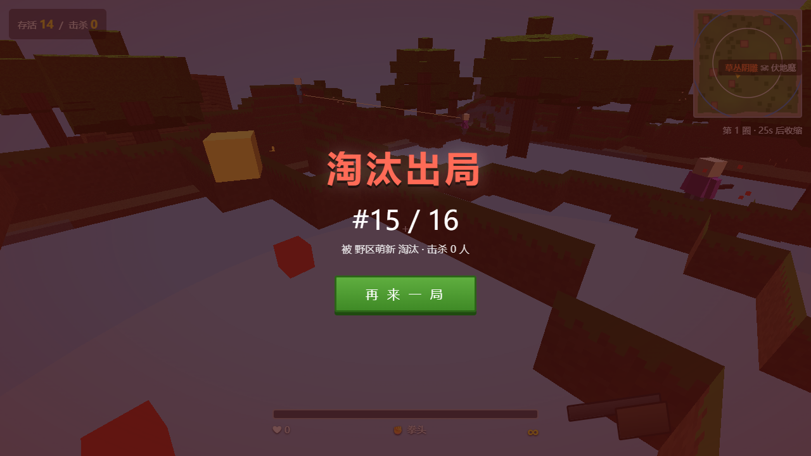

# 方块吃鸡 · Voxel Battle Royale

「我的世界」画风的网页版吃鸡（大逃杀）游戏：16 人空降方块岛，拾取武器物资，毒圈不断收缩，活到最后一人即可 **大吉大利，今晚吃鸡**。

纯前端实现，无需构建、无需联网（three.js 已内置在 `lib/`），双击 `index.html` 即可游玩。

## 界面预览

| 主菜单 | 空降 | 对局 |
| --- | --- | --- |
|  |  |  |

## 玩法

1. **空降**：开局从高空跳伞，`WASD` 控制漂移选择落点，接近地面自动开伞；
2. **搜物资**：走近发光箱子自动拾取——金色=武器、蓝色=弹药、绿色=医疗包、紫色=方块。AI 也会抢武器箱和医疗箱，手慢无；
3. **对枪**：地图上有 15 个 AI 机器人互相搜杀，小心枪声暴露位置。命中头部造成 **1.75 倍爆头伤害**（金色命中标记），每次击杀回血 +15；
4. **缩圈**：蓝色能量墙为安全区边界（收缩时变红警示），圈外持续掉血且伤害逐圈升高，小地图白圈为下一安全区；
5. **吃鸡**：存活到最后即胜利。淘汰或吃鸡后可一键「再来一局」，免刷新直接换新地图开打。

### 我的世界要素

- 程序化体素地形（草原/丘陵/沙滩/树木/可搜物资的小屋），像素纹理全部由代码生成；
- **全地形可破坏**：子弹和拳头都能拆方块（树叶一枪碎，砖石更耐打），可以把敌人的掩体直接打穿；
- **可搭建**：右键放置方块，随时搭桥、堵门、起高台。

## 操作

| 按键 | 功能 |
| --- | --- |
| `W A S D` | 移动 / 跳伞漂移 |
| `Shift` | 奔跑 |
| `空格` | 跳跃 |
| `鼠标左键` | 射击（无枪时挥拳，可拆方块） |
| `鼠标右键` | 放置方块（需先拾取紫色箱子） |
| `C`（按住） | 开镜瞄准：散布更小、灵敏度降低，狙击枪有高倍瞄准镜 |
| `R` | 换弹 |
| `4` | 使用医疗包 |
| `Esc` | 暂停（全场冻结）/ 解锁鼠标 |

## 武器

| 武器 | 伤害 | 射速 | 特点 |
| --- | --- | --- | --- |
| 拳头 | 25 | 慢 | 近战，拆方块 |
| 手枪 | 18 | 中 | 保底武器 |
| 步枪 | 26 | 快 | 全自动，按住扫射 |
| 霰弹枪 | 12×7 | 慢 | 近距离爆发 |
| 狙击枪 | 80 | 很慢 | 远距离一锤定音 |

拾取武器箱时只会替换为更高级的枪，重复/低级武器自动转化为弹药。爆头一律 1.75 倍伤害——狙击爆头可秒杀满血敌人。

## 运行

```bash
# 方式一：直接双击 index.html（Chrome / Edge）

# 方式二：本地起服务（任选其一）
python -m http.server 8000 --directory .
npx serve .
# 然后访问 http://localhost:8000
```

## 项目结构

```
chiji/
├── index.html        # 页面、HUD 与全部样式
├── lib/three.min.js  # three.js r147（已内置，离线可用）
└── src/
    ├── main.js       # 引导、输入、状态机（菜单/对局/死亡/吃鸡）、主循环
    ├── world.js      # 体素世界：地形生成、纹理图集、分块网格、破坏/放置、DDA 射线
    ├── player.js     # 第一人称控制、体素 AABB 碰撞（玩家与 AI 共用）、跳伞
    ├── bots.js       # 15 个 AI：空降/游走/进圈/交战状态机、卡墙自动跳
    ├── weapons.js    # 枪械表、射击判定（体素+实体取最近）、战利品与背包
    ├── zone.js       # 6 阶段缩圈、能量墙可视化、圈外伤害
    ├── hud.js        # 血条/弹药/小地图/击杀播报/结算屏
    └── audio.js      # WebAudio 程序化音效（枪声/命中/缩圈警报，零素材）
```

## 技术说明

- 体素渲染：16×16 分块合并网格，仅生成暴露面，破坏/放置后只重建所在 chunk（及相邻边界 chunk）；
- 射击判定：先做体素 DDA 射线测掩体距离，再与所有实体 AABB 求交，取最近者命中；命中点高于目标 AABB 顶部 0.5m 内判定爆头；
- AI 与玩家共用同一套体素碰撞物理（`Chiji.Physics.collideMove`），AI 会捡武器/医疗箱升级自己，狙击手会主动拉开交战距离；
- 「再来一局」直接换种子重新生成地形并复位全部系统（箱子/特效/毒圈/AI），无需刷新页面；
- `Esc` 暂停时主循环只渲染不推进模拟，整场战斗真正冻结；
- 像素纹理由 canvas 程序化生成（草/土/石/木/叶/板/沙/砖 + 明暗面），无任何外部资源；
- 兼容 Chrome / Edge 桌面端，需要支持 Pointer Lock 与 WebGL。
